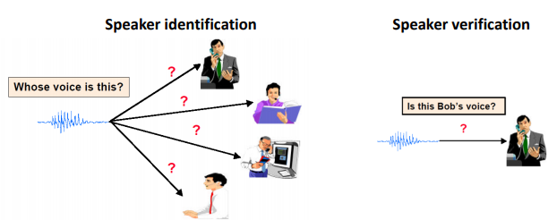
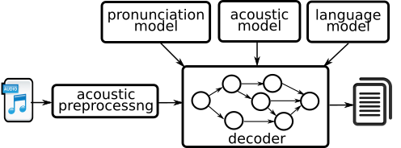
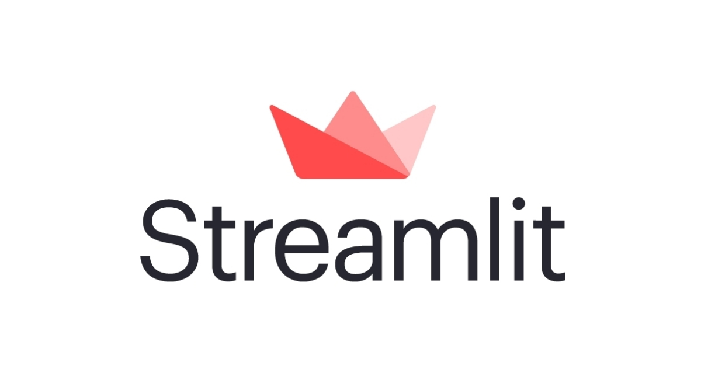

# Mexican NLP Summer School - Tutorial

## An introduction to speech-based technologies for Natural Language Processing applications

This repository contains the code for the workshop (Tutorial) given at the Mexican NLP Summer School. The link to the slides is: [here](https://docs.google.com/presentation/d/1bXqvxy0KQnI3AhsncHj_26p1WdE-UKErplUBJ5BBANI/edit?usp=sharing).

### How to install

```bash
pip install -r requirements.txt
```

### What it is covered

- Speaker Verification
- Automatic Speech Recognition
- Several NLP tasks
- Web application developed in Streamlit

We provide separated recipes for each task. All tasks are blended together in the web-application

#### Speaker Verification

Speaker recognition is the identification of a person from characteristics of voices.[1] It is used to answer the question "Who is speaking?". Additionally, speaker verification (also called speaker authentication) contrasts with identification, and speaker recognition differs from speaker diarisation (recognizing when the same speaker is speaking).



#### Automatic Speech Recognition

Speech recognition is an interdisciplinary subfield of computer science and computational linguistics that develops methodologies and technologies that enable the recognition and translation of spoken language into text. It is also known as speech to text (STT). It incorporates knowledge and research in the computer science, linguistics and computer engineering fields. The most common ways of performing ASR is either with hybrid-based STT (HMM/DNN) and sequence-to-sequence models. Our SST block relies on the later, developed with [speechbrain](https://github.com/speechbrain/speechbrain).



#### Natural Language Processing

Natural Language Processing, usually shortened as NLP, is a branch of artificial intelligence that deals with the interaction between computers and humans using the natural language. The ultimate objective of NLP is to read, decipher, understand, and make sense of the human languages in a manner that is valuable.


#### Web-application (Streamlit)

Streamlit is an open-source app framework for Machine Learning and Data Science teams. Create beautiful data apps in hours, not weeks. All in pure Python.



