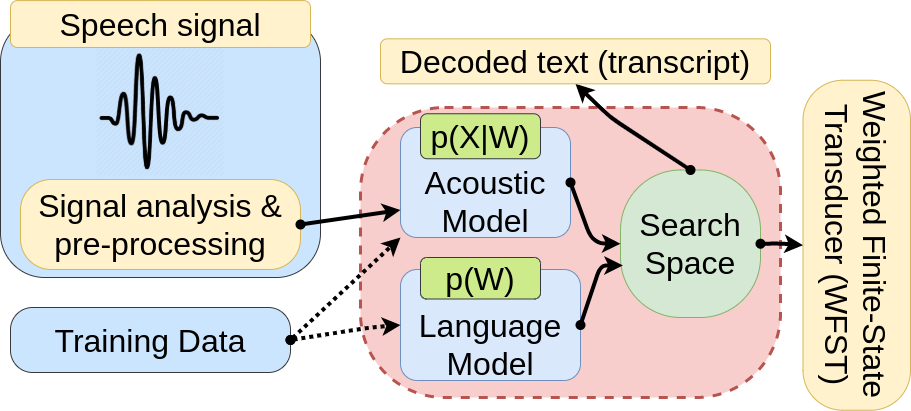

# Mexican NLP Summer School - Tutorial

## An introduction to speech-based technologies for Natural Language Processing applications

This repository contains the code for speech components (ASR and Speaker Verification) for the workshop (Tutorial) given at the Mexican NLP Summer School. The link to the slides is: [here](https://docs.google.com/presentation/d/1bXqvxy0KQnI3AhsncHj_26p1WdE-UKErplUBJ5BBANI/edit?usp=sharing).

### How to install

```bash
git clone https://github.com/maelfabien/NLP_Summer_School-2021_Speech_Tutorial
conda create --name nlp_summer_school_tutorial python=3.8
conda activate nlp_summer_school_tutorial
pip install -r requirements.txt
```

#### Speaker Verification

Speaker recognition is the identification of a person from characteristics of voices.[1] It is used to answer the question "Who is speaking?". Additionally, speaker verification (also called speaker authentication) contrasts with identification, and speaker recognition differs from speaker diarisation (recognizing when the same speaker is speaking).


#### Automatic Speech Recognition

Speech recognition is an interdisciplinary subfield of computer science and computational linguistics that develops methodologies and technologies that enable the recognition and translation of spoken language into text. It is also known as speech to text (STT). It incorporates knowledge and research in the computer science, linguistics and computer engineering fields. The most common ways of performing ASR is either with hybrid-based STT (HMM/DNN) and sequence-to-sequence models. Our SST block relies on the later, developed with [speechbrain](https://github.com/speechbrain/speechbrain).


